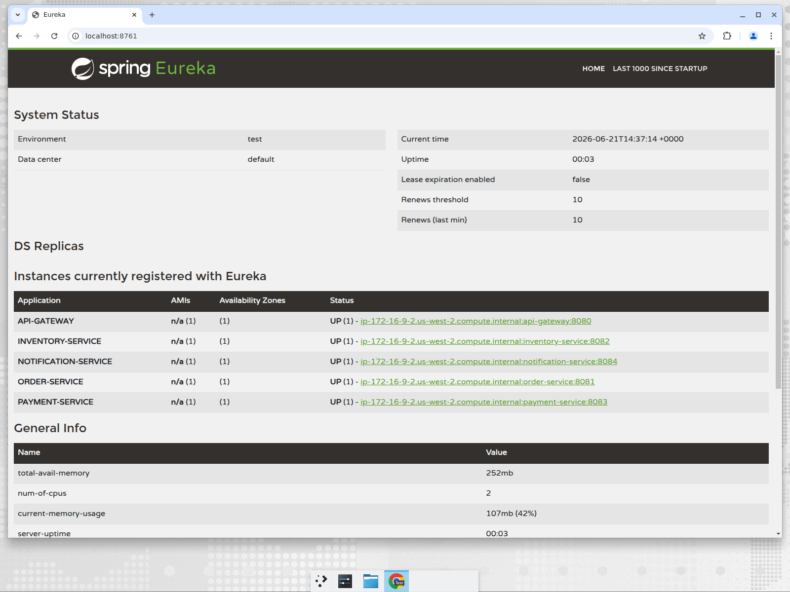

# E-Commerce Order Management System (Microservices)

An event-driven **E-Commerce Order Management System** built with **Java 8, Spring Boot, Spring Cloud, and Apache Kafka**. It models a realistic distributed workflow: a customer places an order, stock is reserved, payment is captured, and the customer is notified — coordinated across independent microservices using the **Saga (choreography) pattern** with automatic compensation on failure.

> Built as a portfolio / interview project. See [`docs/INTERVIEW.md`](docs/INTERVIEW.md) for talking points and likely Q&A.

---

## Tech Stack

| Area | Technology |
|------|-----------|
| Language | Java 8 |
| Framework | Spring Boot 2.7.x |
| Microservices | Spring Cloud 2021.0.x (Netflix Eureka, Spring Cloud Gateway, OpenFeign-ready) |
| Messaging | Apache Kafka (event-driven, Saga choreography) |
| Persistence | Spring Data JPA + Hibernate; H2 (default) / MySQL (profile) |
| API | REST (JSON), Bean Validation |
| Build | Maven (multi-module) |
| Infra | Docker Compose (Kafka, Zookeeper, Kafka UI, MySQL) |
| Boilerplate | Lombok |

---

## Architecture at a Glance

```
                       ┌──────────────────┐
   Client ───────────► │   API Gateway    │  (Spring Cloud Gateway, :8080)
                       └────────┬─────────┘
                                │  routes /api/** via Eureka
        ┌───────────────┬───────┴────────┬────────────────┐
        ▼               ▼                ▼                ▼
 ┌────────────┐  ┌──────────────┐  ┌────────────┐  ┌────────────────┐
 │   order    │  │  inventory   │  │  payment   │  │  notification  │
 │  service   │  │   service    │  │  service   │  │    service     │
 │  :8081     │  │   :8082      │  │  :8083     │  │    :8084       │
 └─────┬──────┘  └──────┬───────┘  └─────┬──────┘  └───────┬────────┘
       │ orderDB        │ inventoryDB     │ paymentDB        │ notificationDB
       └────────────────┴──── Apache Kafka (events) ────────┘
                                │
                       ┌────────┴─────────┐
                       │ Eureka Discovery │  (:8761)
                       └──────────────────┘
```

All services registered with the Eureka discovery server:



Full details and diagrams:
- [`docs/ARCHITECTURE.md`](docs/ARCHITECTURE.md) — components, design decisions, data ownership
- [`docs/SEQUENCE_DIAGRAM.md`](docs/SEQUENCE_DIAGRAM.md) — Mermaid sequence diagrams for every flow
- [`docs/API.md`](docs/API.md) — REST endpoints with request/response examples
- [`docs/INTERVIEW.md`](docs/INTERVIEW.md) — how to present this project in interviews

---

## Services

| Service | Port | Responsibility |
|---------|------|----------------|
| `discovery-server` | 8761 | Eureka service registry |
| `api-gateway` | 8080 | Single entry point; routes to services via Eureka |
| `order-service` | 8081 | Owns orders; starts the saga; confirms/cancels orders |
| `inventory-service` | 8082 | Owns stock; reserves/releases inventory |
| `payment-service` | 8083 | Captures payment; emits success/failure |
| `notification-service` | 8084 | Sends customer notifications on terminal events |
| `common-events` | — | Shared Kafka event contracts + topic names |

---

## The Saga (choreography)

```
OrderCreated ─► [inventory reserves stock] ─► InventoryReserved ─► [payment charges] ─► PaymentCompleted ─► order CONFIRMED
                         │                                                   │
                         └─ InventoryFailed ─► order CANCELLED               └─ PaymentFailed ─► order CANCELLED
                                                                                    │
                                                                  (compensation) inventory releases stock
```

Three flows are demonstrated by [`scripts/demo.sh`](scripts/demo.sh):
1. **Happy path** → order `CONFIRMED`
2. **Payment failure** (amount over the approval limit) → order `CANCELLED` + reserved stock released (compensation)
3. **Out of stock** → order `CANCELLED`

---

## Quick Start

### Prerequisites
- JDK 8
- Maven 3.6+
- Docker + Docker Compose (for Kafka)

### 1. Start infrastructure (Kafka + Zookeeper)
```bash
docker compose up -d zookeeper kafka
# optional UIs / MySQL:
# docker compose up -d kafka-ui mysql
```

### 2. Build everything
```bash
mvn -DskipTests clean package
```

### 3. Start all services
```bash
./scripts/start-all.sh      # boots all 6 services in order (logs in ./logs)
```
- Eureka dashboard: http://localhost:8761
- Kafka UI (if started): http://localhost:8090

### 4. Run the end-to-end demo
```bash
./scripts/demo.sh
```

### 5. Stop everything
```bash
./scripts/stop-all.sh
docker compose down
```

### Try a single request
```bash
curl -X POST http://localhost:8080/api/orders \
  -H 'Content-Type: application/json' \
  -d '{"productCode":"LAPTOP-001","quantity":1,"amount":999,"customerEmail":"alice@example.com"}'

curl http://localhost:8080/api/orders        # watch status go PENDING -> CONFIRMED
```

Seeded products: `LAPTOP-001` (10), `PHONE-001` (25), `HEADSET-001` (3).
Payment approval limit (configurable) is **5000** — orders above it fail to demo compensation.

---

## Switching to MySQL
Each service defaults to in-memory H2 (zero setup). To use MySQL:
```bash
docker compose up -d mysql
java -jar order-service/target/order-service-1.0.0.jar --spring.profiles.active=mysql
# (repeat for the other JPA services)
```

---

## Repository Layout
```
ecommerce-microservices/
├── pom.xml                 # parent (dependency + module management)
├── common-events/          # shared Kafka event contracts
├── discovery-server/       # Eureka
├── api-gateway/            # Spring Cloud Gateway
├── order-service/          # REST + JPA + Kafka (producer & consumer)
├── inventory-service/      # JPA + Kafka (reserve / release)
├── payment-service/        # JPA + Kafka (charge / refund signal)
├── notification-service/   # JPA + Kafka (notify)
├── docker-compose.yml      # Kafka, Zookeeper, Kafka UI, MySQL
├── scripts/                # start-all / stop-all / demo
└── docs/                   # ARCHITECTURE, SEQUENCE_DIAGRAM, API, INTERVIEW
```

---

## Author
**Debasis Jena** — Java Backend Developer
GitHub: [@JavaTechDebasis](https://github.com/JavaTechDebasis)
