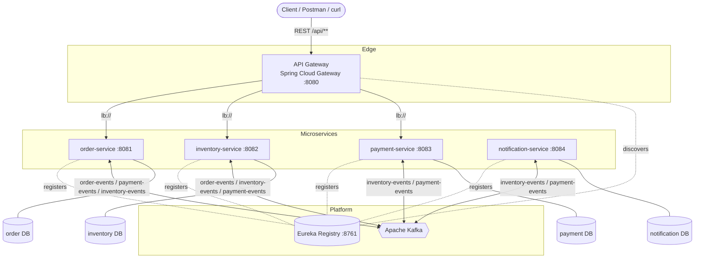
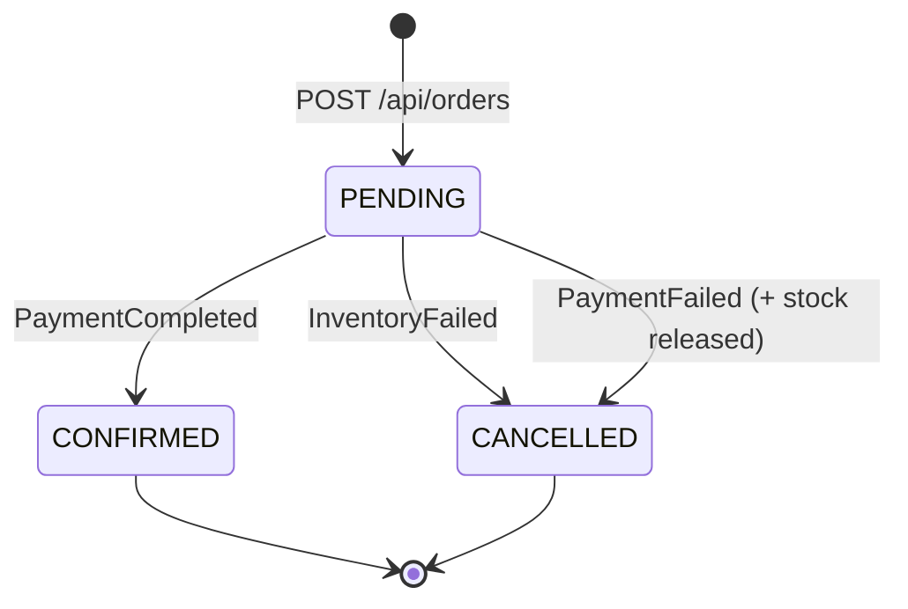

# Architecture

## 1. Overview

This system implements an **E-Commerce Order Management** workflow as a set of small, independently deployable microservices that communicate **asynchronously over Apache Kafka**. Synchronous client traffic enters through an **API Gateway**; services find each other through a **Eureka** service registry. Each service owns its **own database** (database-per-service), and there are **no synchronous service-to-service calls** in the order workflow — the business process is driven entirely by domain events using the **Saga choreography** pattern.

### Design goals
- **Loose coupling** — services interact through events, not direct REST calls, so one service being down doesn't break the others (messages buffer in Kafka).
- **Data ownership** — every service is the single source of truth for its data.
- **Resilience** — failures trigger **compensating transactions** instead of distributed locks / 2-phase commit.
- **Observability** — every state transition is logged; terminal outcomes are persisted as notifications.

---

## 2. Component View

---

## 3. Services and Responsibilities

| Service | Owns | Consumes (Kafka) | Produces (Kafka) | REST |
|---------|------|------------------|------------------|------|
| **order-service** | Orders + lifecycle | `inventory-events` (failed), `payment-events` (completed/failed) | `order-events` (OrderCreated) | `POST /api/orders`, `GET /api/orders`, `GET /api/orders/{id}` |
| **inventory-service** | Product stock | `order-events` (created), `payment-events` (failed → release) | `inventory-events` (reserved/failed) | `GET /api/inventory` |
| **payment-service** | Payments | `inventory-events` (reserved) | `payment-events` (completed/failed) | `GET /api/payments` |
| **notification-service** | Notifications log | `inventory-events` (failed), `payment-events` (completed/failed) | — | `GET /api/notifications` |
| **api-gateway** | Routing | — | — | proxies `/api/**` |
| **discovery-server** | Service registry | — | — | Eureka dashboard `/` |

---

## 4. Eventing Model

### Topics
| Topic | Producer | Events carried |
|-------|----------|----------------|
| `order-events` | order-service | `OrderCreatedEvent` |
| `inventory-events` | inventory-service | `InventoryReservedEvent`, `InventoryFailedEvent` |
| `payment-events` | payment-service | `PaymentCompletedEvent`, `PaymentFailedEvent` |

All event classes live in the shared **`common-events`** module so producers and consumers share a single contract.

### Serialization
- Producers use Spring Kafka's `JsonSerializer`.
- Consumers use `ErrorHandlingDeserializer` wrapping `JsonDeserializer`, with `spring.json.trusted.packages` restricted to the shared event package. The `ErrorHandlingDeserializer` ensures a single malformed ("poison pill") message cannot permanently block a partition.
- The event's fully-qualified type travels in a Kafka header (`__TypeId__`), letting a single listener subscribe to a multi-type topic and dispatch by payload type via class-level `@KafkaListener` + `@KafkaHandler`.

### Message keys & ordering
Every event is keyed by `orderId`, so all events for one order land on the same partition and are processed **in order**, which is essential for a correct saga.

---

## 5. The Saga (Choreography)

There is no central orchestrator. Each service reacts to events and emits new ones:

1. `order-service` persists the order as **PENDING** and emits `OrderCreatedEvent`.
2. `inventory-service` reserves stock → `InventoryReservedEvent`, or fails → `InventoryFailedEvent`.
3. `payment-service` (on reserved) captures payment → `PaymentCompletedEvent`, or fails → `PaymentFailedEvent`.
4. `order-service` sets the order **CONFIRMED** (payment completed) or **CANCELLED** (inventory/payment failed).
5. **Compensation:** on `PaymentFailedEvent`, `inventory-service` releases the previously reserved stock.
6. `notification-service` reacts to terminal events and notifies the customer.

### Why choreography (not orchestration)?
- Fewer moving parts for a workflow of this size; no single point of coordination.
- Services stay autonomous and only depend on event contracts.
- Trade-off: the end-to-end flow is implicit (spread across services). For larger, branchier workflows an **orchestration** saga (e.g. a dedicated orchestrator) is easier to reason about — a great point to raise in interviews.

---

## 6. Data Management

- **Database per service** — `order-service`, `inventory-service`, `payment-service`, and `notification-service` each have an isolated schema (H2 by default, MySQL via the `mysql` profile). No shared database, no cross-service joins.
- **Optimistic locking** — `Product` uses a JPA `@Version` column so concurrent reservations of the same product don't lose updates.
- **Idempotency** — `payment-service` checks `existsByOrderId` before charging, so a redelivered `InventoryReservedEvent` does not double-charge.

---

## 7. Resilience & Reliability Notes
- **At-least-once delivery**: Kafka consumers may see a message more than once; idempotency keys (orderId) guard the critical step.
- **Poison-pill isolation**: `ErrorHandlingDeserializer` prevents deserialization failures from halting consumption.
- **Loose temporal coupling**: if `payment-service` is down, `InventoryReservedEvent` waits in Kafka and is processed when it recovers.
- **Compensation over rollback**: distributed state is reconciled by emitting compensating events rather than holding distributed transactions.

---

## 8. Technology Choices

| Decision | Rationale |
|----------|-----------|
| Java 8 + Spring Boot 2.7 | Matches a very common enterprise baseline; 2.7 is the last line supporting Java 8. |
| Kafka | Durable, partitioned, replayable log — ideal for event-driven sagas. |
| Eureka + Spring Cloud Gateway | Battle-tested Netflix/Spring Cloud stack for discovery + edge routing. |
| Database-per-service | Enforces service autonomy and clear ownership. |
| H2 default, MySQL profile | Runs anywhere with zero setup, but production-like DB is one flag away. |
| Multi-module Maven | Single build, shared event contracts, consistent dependency management. |

---

## 9. Possible Extensions (talking points)
- Replace H2 with MySQL/PostgreSQL per service in production.
- Add **Spring Cloud Config** for centralized configuration.
- Add **Resilience4j** (circuit breaker / retry) around any synchronous calls.
- Add **distributed tracing** (Micrometer Tracing + Zipkin) to follow a saga across services.
- Add the **transactional outbox** pattern to make "save to DB + publish event" atomic.
- Add a **dead-letter topic** for messages that fail repeatedly.
