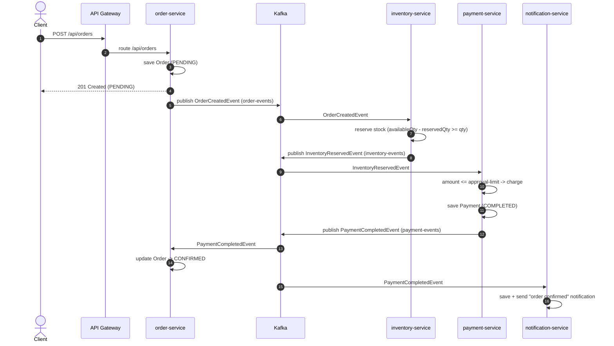
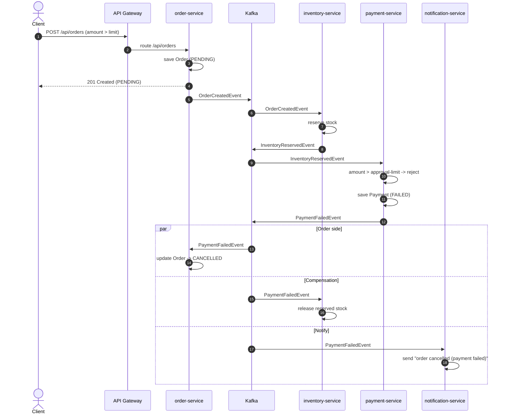
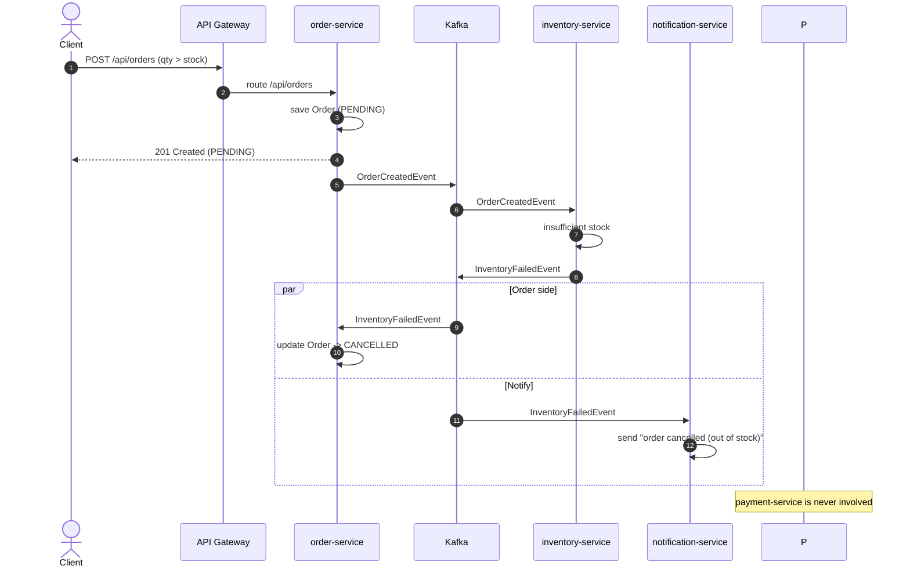
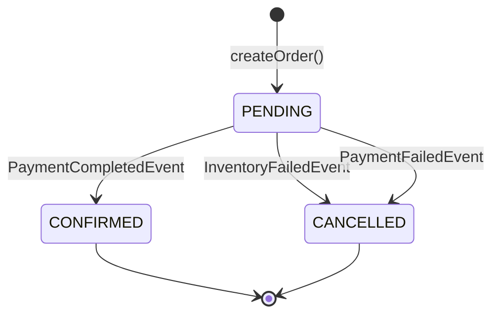

# Sequence Diagrams

These diagrams use [Mermaid](https://mermaid.js.org/), which renders automatically on GitHub. Each diagram shows one flow through the choreography saga.

---

## 1. Happy Path — Order Confirmed

---

## 2. Payment Failure — Order Cancelled + Compensation

The amount exceeds the payment approval limit, so payment fails. The order is cancelled **and** the inventory previously reserved is released (the compensating action).

---

## 3. Out of Stock — Order Cancelled Early

Inventory reservation fails immediately, so the saga short-circuits before payment.

---

## 4. State Machine (Order)

